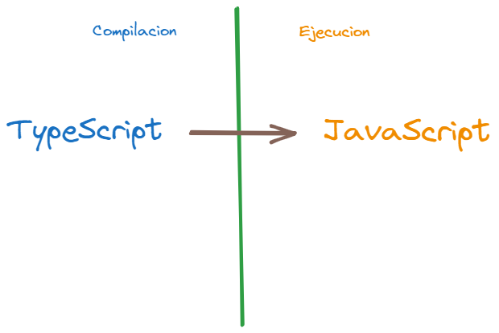

#backend #frontend #developer

# Que es TypeScript

En terminos generales, es el mismos JavaScript pero con funcionalidades adicionales, es JavaScript con “Poderes”, compartiendo todo el core original de JavaScript, pero adicionando un Tipado de alto nivel que nos permite evitar errores y desarrollar productos de mejor calidad.

# Por que TS

Es recomendado usarlo por lo mencionado anteriormente, nos ayuda con errores y a desarrollar productos de calidad, ademas de esto en los ultimos años gano popularidad, convirtiendolo en un lenguaje que genera buen empleo.

**Practica TS online** ⬇️

[TS Playground - An online editor for exploring TypeScript and JavaScript](https://www.typescriptlang.org/play)

# TypeScript no funciona en tiempo de compilacion

Al principio esto puede sonar algo confuso, pero es muy importante entender este concepto.

**El navegador no entiende el código TS, por ende debe convertirse a JS para que el navegador entienda e interprete esto.**

]
